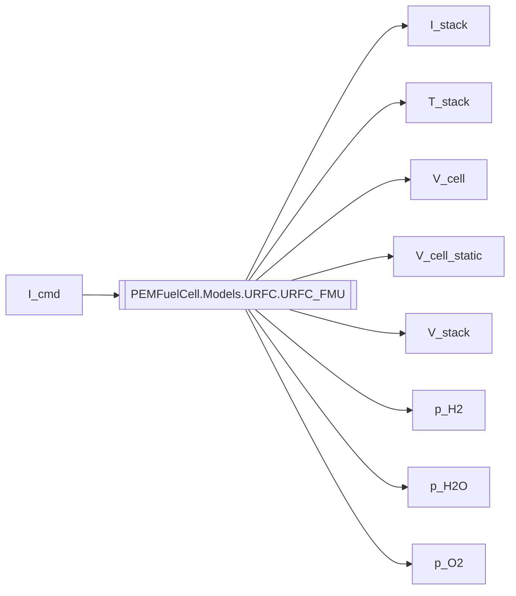

```mermaid
flowchart LR
  I_cmd["I_cmd"] --> FMU
  FMU[["PEMFuelCell.Models.URFC.URFC_FMU"]]
  FMU --> I_stack_o["I_stack"]
  FMU --> T_stack_o["T_stack"]
  FMU --> V_cell_o["V_cell"]
  FMU --> V_cell_static_o["V_cell_static"]
  FMU --> V_stack_o["V_stack"]
  FMU --> p_H2_o["p_H2"]
  FMU --> p_H2O_o["p_H2O"]
  FMU --> p_O2_o["p_O2"]
```
